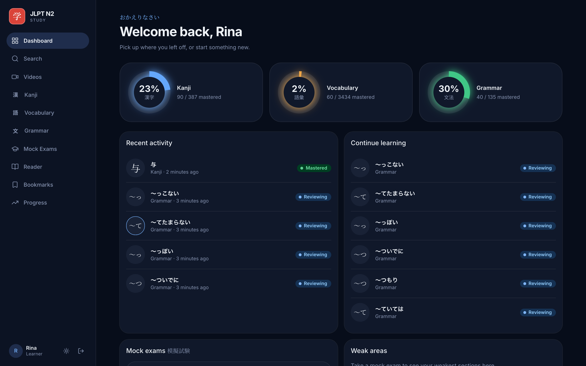
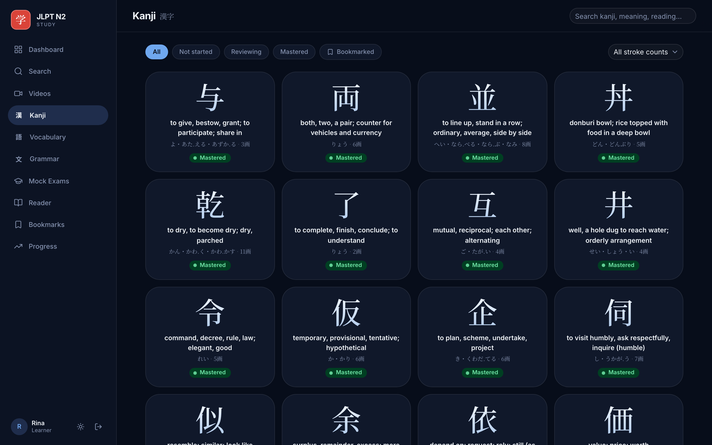
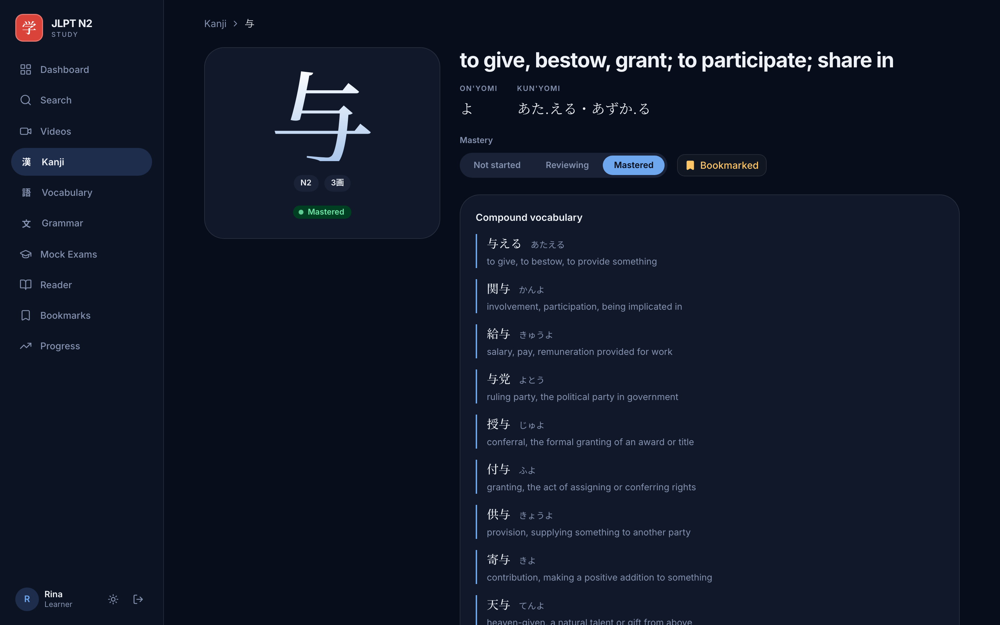
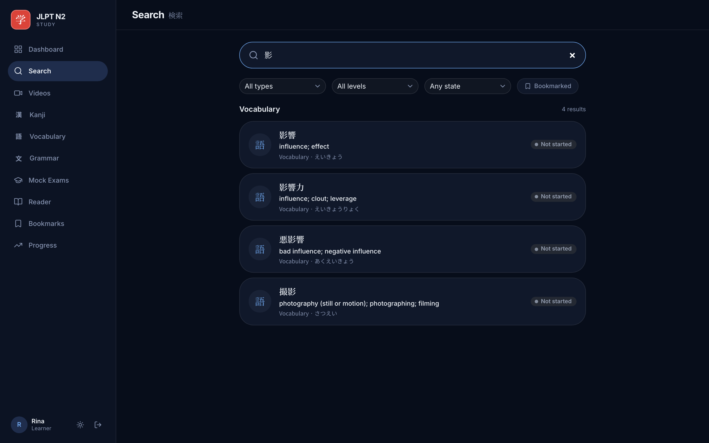
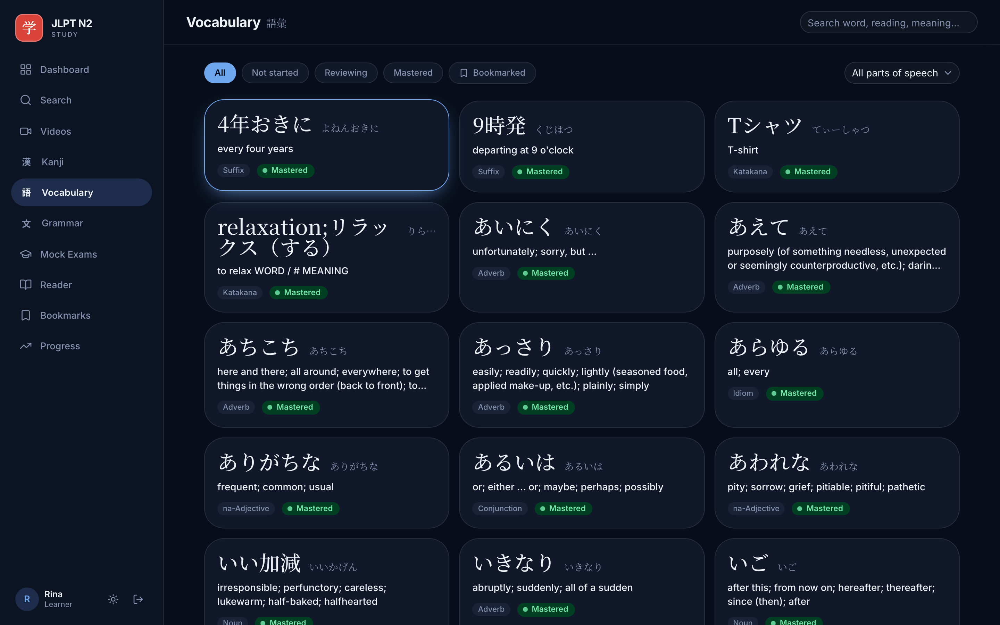
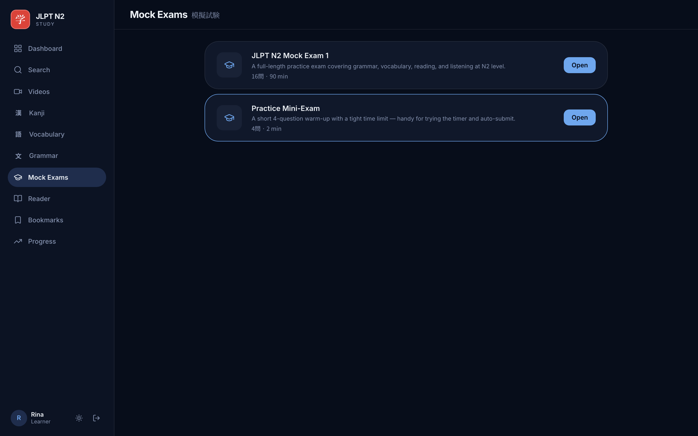
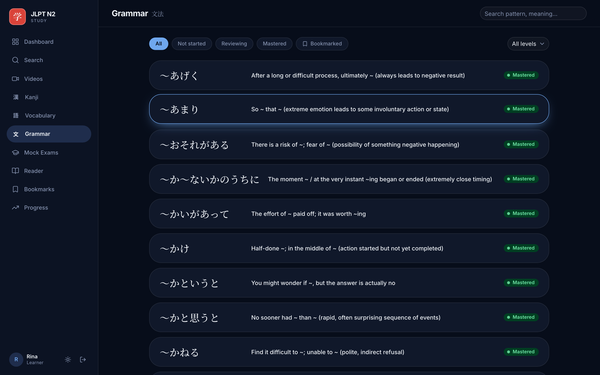
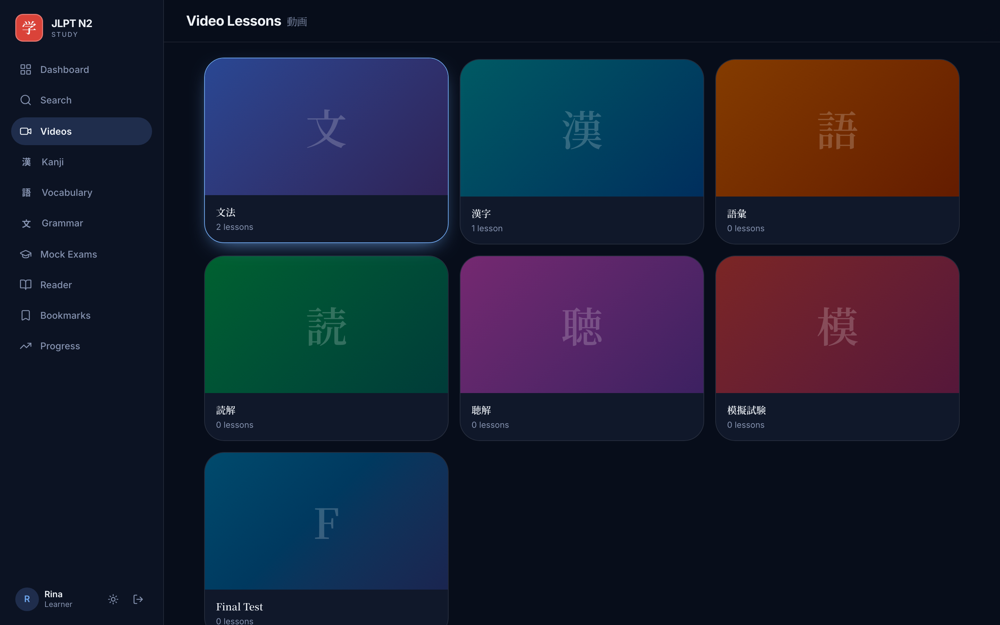
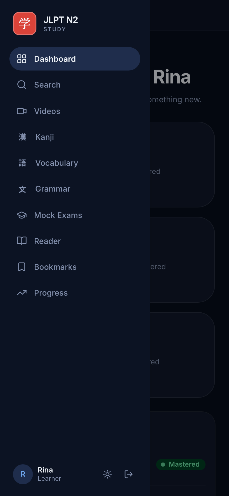

# JLPT N2 Study

A fullstack Japanese-language learning platform for JLPT N2 preparation. It combines structured video lessons, kanji / vocabulary / grammar study with mastery tracking, timed mock exams, AI-generated example sentences, and an in-browser light-novel reader with tap-to-lookup — all in a single Next.js app.

## Screenshots

*"Sumi Night" — a dark ink-wash theme with serif Japanese display type. A light theme ships too, toggled from the sidebar.*



| Kanji browsing | Kanji detail |
|---|---|
|  |  |

| Global search | Vocabulary | Mock exams |
|---|---|---|
|  |  |  |

<details>
<summary>More: grammar, videos, mobile</summary>

| Grammar | Videos |
|---|---|
|  |  |



</details>

## Features

- **Video lessons** organized into content groups (Google Drive embeds), with progress + bookmarks.
- **Kanji / Vocabulary / Grammar** study: searchable, filterable lists (including mastery-state and bookmarked filters), detail pages, and per-user mastery tracking (`unseen → reviewing → mastered`).
- **Global search** across all four resource types with type / JLPT / mastery / bookmarked filters.
- **Mock exams**: timed, section-based, server-authoritative scoring, resumable attempts, and a review page with the answer key.
- **AI example sentences** generated on demand (OpenAI `gpt-4o-mini`) and persisted per item.
- **Light-novel reader** (epubjs) with inline word/kanji lookup from the study database and per-book reading-position sync.
- **Bookmarks, progress, and a dashboard** aggregating real study data.
- **Admin** content management for every resource type.

## Tech stack

- **Framework:** Next.js 16 (App Router) + React 19 + TypeScript
- **Data:** Drizzle ORM + drizzle-kit against Neon PostgreSQL (serverless); IDs are cuid2
- **Auth:** Better Auth (email/password sessions + admin/learner RBAC)
- **Client data:** TanStack Query v5 (calls Route Handlers); Zustand for UI-only state; Zod for validation
- **AI:** Vercel AI SDK + OpenAI `gpt-4o-mini`
- **Reader:** epubjs
- **UI:** Tailwind CSS v4 + shadcn/ui (Base UI primitives)
- **Testing:** Vitest (unit) + Playwright (e2e)
- **Deploy:** Vercel + Neon

## Quick start

Prerequisites: **Node 20+**, **pnpm**, and a **Neon** (or any Postgres) database.

```bash
# 1. Install
pnpm install

# 2. Configure environment
cp .env.example .env          # then fill in the values (see below)

# 3. Create the schema
pnpm db:generate              # generate the migration from schema.ts
pnpm db:migrate               # apply it to the database

# 4. Seed content (requires the local seed-data files — see "Seed data")
pnpm db:seed:videos
pnpm db:seed:kanji
pnpm db:seed:vocabulary
pnpm db:seed:grammar
pnpm db:seed:mock-exams
pnpm db:seed:books

# 5. Run
pnpm dev                      # http://localhost:3000
```

Register the first account at `/register`. To make it an admin, set that user's `user_profiles.role` to `admin` (e.g. via `pnpm db:studio`).

## Environment variables

Copy `.env.example` to `.env` and set:

| Variable | Required | Purpose |
|----------|----------|---------|
| `DATABASE_URL` | yes | Neon/Postgres connection string (`?sslmode=require` for Neon) |
| `BETTER_AUTH_SECRET` | yes | Session signing secret — generate with `openssl rand -base64 32` (≥32 chars) |
| `BETTER_AUTH_URL` | yes | App base URL (`http://localhost:3000` in dev) |
| `OPENAI_API_KEY` | for AI examples | OpenAI key used by the AI example generator |
| `BLOB_READ_WRITE_TOKEN` | for epub upload | Vercel Blob token for admin epub uploads |

## Scripts

```bash
pnpm dev            # start the dev server
pnpm build          # production build
pnpm start          # run the production build
pnpm lint           # ESLint
pnpm typecheck      # tsc --noEmit
pnpm test           # Vitest unit tests
pnpm test:e2e       # Playwright e2e (needs a running app + seeded DB)

pnpm db:generate    # create a migration from schema.ts
pnpm db:migrate     # apply migrations
pnpm db:studio      # inspect the DB in Drizzle Studio
pnpm db:seed:*      # seed videos / kanji / vocabulary / grammar / mock-exams / books
```

## Architecture overview

- **Two data-access paths, one client.** Server Components may query the Drizzle client (`src/lib/db`) directly for initial loads; everything client-driven goes through Route Handlers (`src/app/api/*`) via TanStack Query. Both share the same DB client.
- **Auth gate.** Every `/api/*` route (except `/api/auth/*`) checks the session via `getServerSession()`; the `(app)` route-group layout guards learner pages and `requireAdmin`/`requireAdminPage` guard the admin area. `admin` can manage content and read all learner data; `learner` sees only their own progress/bookmarks/exam data.
- **App shell.** Learner pages live under the `src/app/(app)/` route group behind a shared responsive shell (sidebar on desktop, drawer on mobile). URLs are unaffected by the group.
- **Services layer.** `src/services/*` holds the Drizzle queries (list/detail/filter/pagination, per-user progress joins). Shared filter helpers live in `src/services/study-filters.ts`.
- **Exam scoring is server-authoritative** and transactional — the server re-scores from the DB and never trusts a client-supplied `isCorrect`. The live timer lives in `useExamStore`.
- **AI generation** uses `generateObject` with a Zod output schema (structured output), persists to `generated_example_sentences`, and is rate-limited to 10 req/min per user.
- **Reader lookup** calls `GET /api/lookup?q=...` on text selection and persists reading position per user/book as an epubjs CFI string.

See [docs/diagrams/architecture.md](docs/diagrams/architecture.md) for system/sequence/ER diagrams, [docs/DATABASE.md](docs/DATABASE.md) for the schema, and [docs/API.md](docs/API.md) for the endpoint reference. Planned directory layout mirrors `src/app` (pages), `src/components`, `src/hooks`, `src/lib`, `src/services`, and `src/store`.

## Seed data

The seed scripts read JSON files in `scripts/seed-data/`, which are **local-only and gitignored** (derived from copyrighted source PDFs, so not redistributed). A fresh clone won't include them; without them the app runs but the study lists are empty. Seed ordering matters — grammar items must be inserted before grammar examples (examples join by pattern string).

## Testing

- **Unit** (`pnpm test`): Vitest, with the DB client mocked — services, validation, and auth logic run without a connection.
- **End-to-end** (`pnpm test:e2e`): Playwright drives a real dev server (`webServer` in `playwright.config.ts`) against a **seeded** database. Specs register a fresh user per run, so a working `DATABASE_URL` + `BETTER_AUTH_*` and seed data are required.
