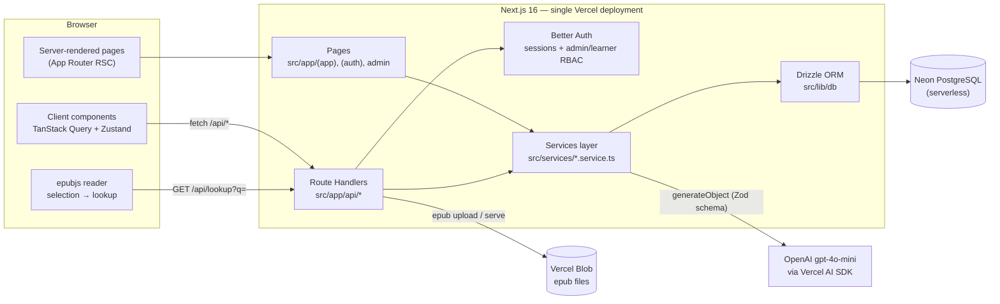
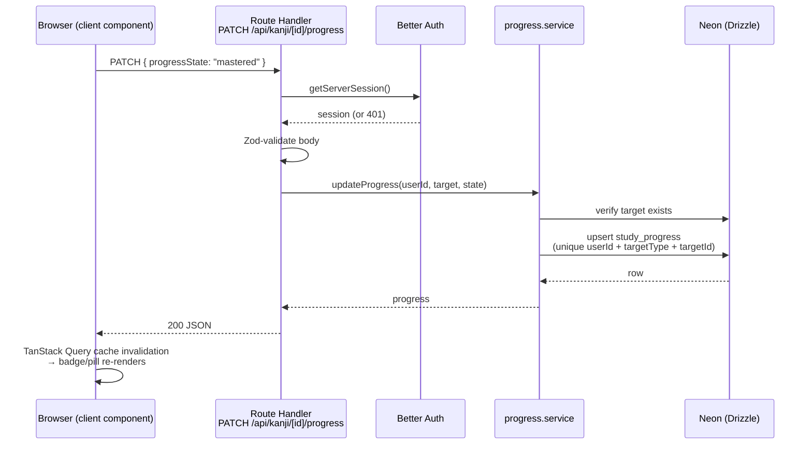
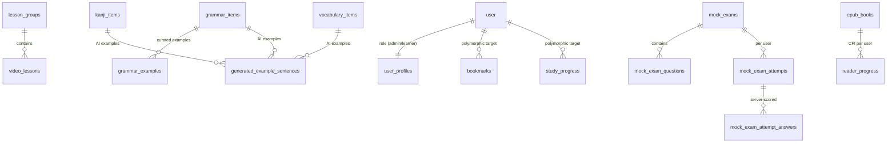

# Architecture Diagrams

## System overview

One Next.js 16 deployment serves both the UI and the API. Server Components read
the database directly for initial loads; everything client-driven goes through
Route Handlers via TanStack Query. Both paths share the same Drizzle client.

## Request flow — a study interaction

What happens when a learner sets a kanji's mastery state:

## Data model (core relationships)

The full schema is documented in [../DATABASE.md](../DATABASE.md). The shape in brief:

